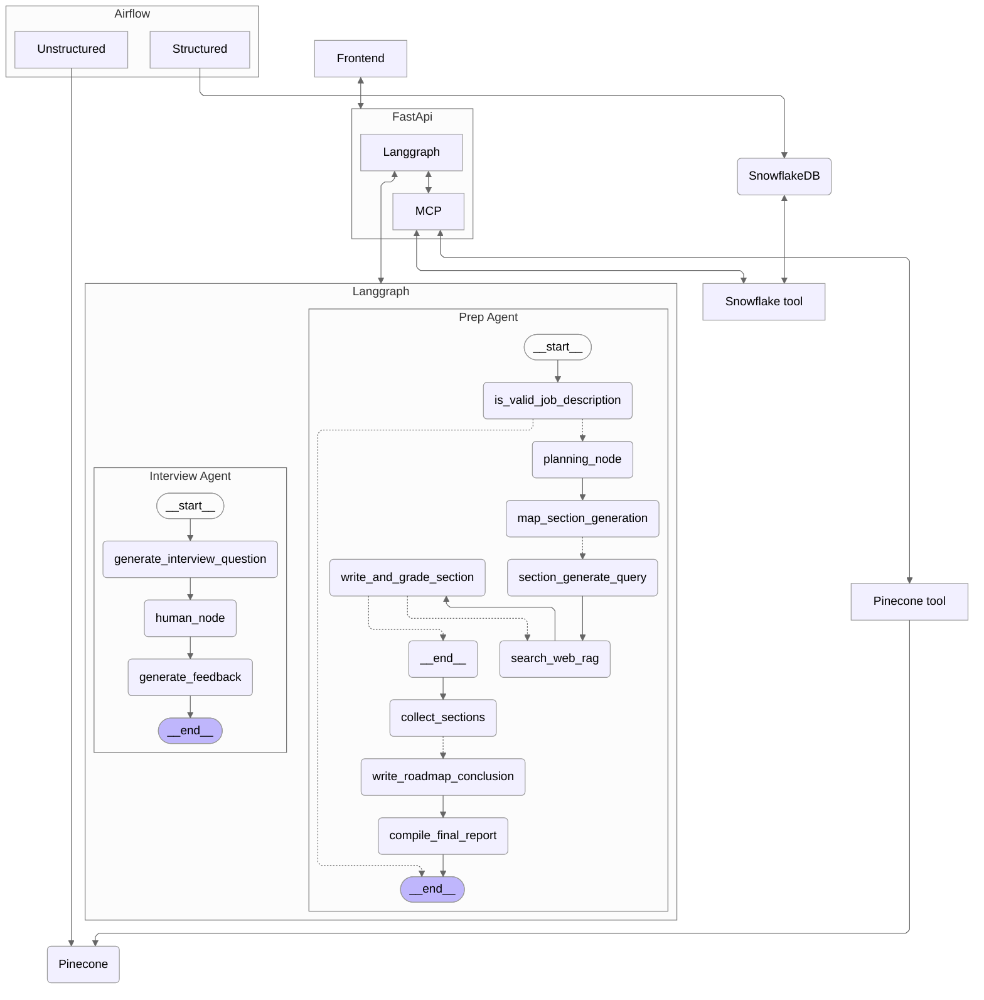

```mermaid
---
config:
  flowchart:
    curve: linear
  layout: elk
  theme: neutral
  look: classic
---
flowchart TD
 subgraph s1["Prep Agent"]
        __start__(["<p>__start__</p>"])
        is_valid_job_description("is_valid_job_description")
        planning_node("planning_node")
        map_section_generation("map_section_generation")
        collect_sections("collect_sections")
        write_roadmap_conclusion("write_roadmap_conclusion")
        compile_final_report("compile_final_report")
        __end__(["<p>__end__</p>"])
        generate_sections_section_generate_query("section_generate_query")
        generate_sections_search_web_rag("search_web_rag")
        generate_sections___end__("<p>__end__</p>")
        generate_sections_write_and_grade_section("write_and_grade_section")
  end
 subgraph s2["Interview Agent"]
        __interview_start__(["<p>__start__</p>"])
        generate_interview_question("generate_interview_question")
        human_node("human_node")
        generate_feedback("generate_feedback")
        __interview_end__(["<p>__end__</p>"])
  end
 subgraph s3["Langgraph"]
        s1
        s2
  end
 subgraph s4["FastApi"]
        n1["MCP"]
        n2["Langgraph"]
  end
 subgraph s5["Airflow"]
        n9["Unstructured"]
        n10["Structured"]
  end
    __interview_start__ --> generate_interview_question
    generate_feedback --> __interview_end__
    generate_interview_question --> human_node
    human_node --> generate_feedback
    __start__ --> is_valid_job_description
    compile_final_report --> __end__
    generate_sections___end__ --> collect_sections
    planning_node --> map_section_generation
    write_roadmap_conclusion --> compile_final_report
    collect_sections -.-> write_roadmap_conclusion
    is_valid_job_description -.-> planning_node & __end__
    map_section_generation -.-> generate_sections_section_generate_query
    generate_sections_search_web_rag --> generate_sections_write_and_grade_section
    generate_sections_section_generate_query --> generate_sections_search_web_rag
    generate_sections_write_and_grade_section -.-> generate_sections___end__ & generate_sections_search_web_rag
    n2 <--> s3 & n1
    n1 <--> n3["Snowflake tool"] & n4["Pinecone tool"]
    n5["Frontend"] <--> s4
    n7["SnowflakeDB"] <--> n3
    n4 --> n8["Pinecone"]
    n9 --> n8
    n10 --> n7
    n2@{ shape: rect}
    n10@{ shape: rect}
    n3@{ shape: rect}
    n4@{ shape: rect}
    n5@{ shape: rect}
    n7@{ shape: rounded}
    n8@{ shape: rounded}
     __start__:::first
     __end__:::last
     __interview_start__:::first
     __interview_end__:::last
    classDef default fill:#f2f0ff,line-height:1.2,fill:#f2f0ff,line-height:1.2
    classDef first fill-opacity:0,fill-opacity:0
    classDef last fill:#bfb6fc,fill:#bfb6fc
```
